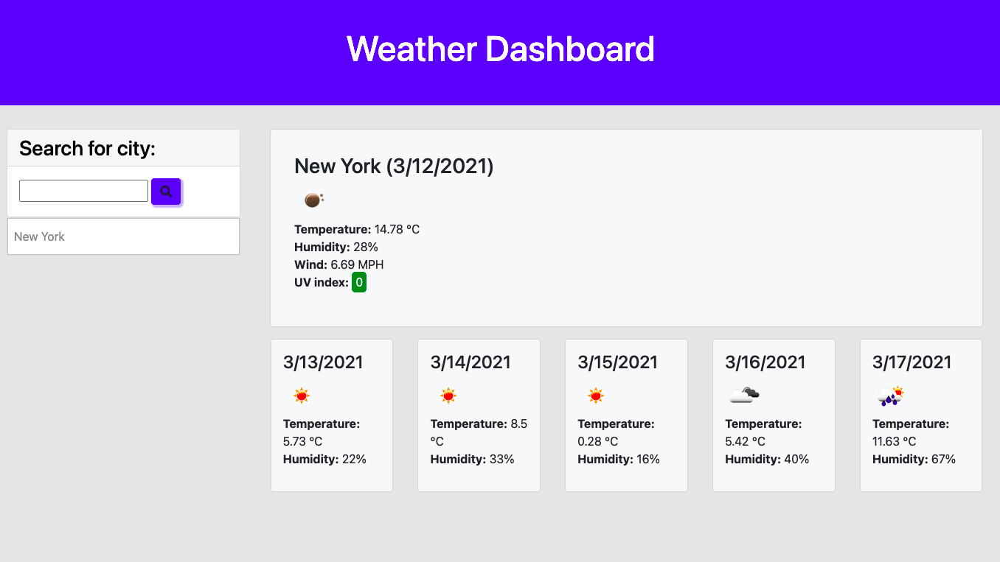

# Server-Side APIs: Weather Dashboard

## Description

A weather dashboard that will run in thr browser and features dynamically updated HTML and CSS. It utilizes the [OpenWeather API](https://openweathermap.org/api) to retrieve weather data for cities.

## User Story

```
AS A traveler
I WANT to see the weather outlook for multiple cities
SO THAT I can plan a trip accordingly
```

## Acceptance Criteria

```
GIVEN a weather dashboard with form inputs
WHEN I search for a city
THEN I am presented with current and future conditions for that city and that city is added to the search history
WHEN I view current weather conditions for that city
THEN I am presented with the city name, the date, an icon representation of weather conditions, the temperature, the humidity, the wind speed, and the UV index
WHEN I view the UV index
THEN I am presented with a color that indicates whether the conditions are favorable, moderate, or severe
WHEN I view future weather conditions for that city
THEN I am presented with a 5-day forecast that displays the date, an icon representation of weather conditions, the temperature, and the humidity
WHEN I click on a city in the search history
THEN I am again presented with current and future conditions for that city
```

## Mock-Up

The following image shows the web application's appearance and functionality:
1) Search for a city


2) When you click the search button or press enter, the current weather appears with the 5-day forecast weather below


3) A list of your past searchs will be kept on the right side, you can click on any of them to show the weather for that city again


Deployed link: https://mackenzielc.github.io/homework-6/ 